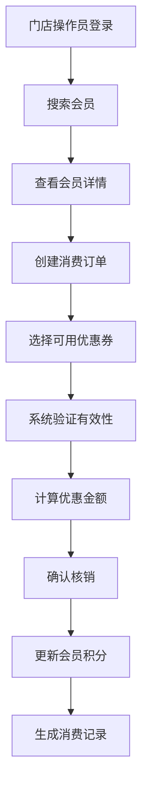

# 药店会员管理系统 PRD

## 1. 产品概述
药店会员管理系统是一个面向连锁药店的会员管理解决方案，实现总部统一管理会员档案和优惠券发放，门店端提供会员消费记录查询和优惠券核销功能。

- 主要目的：提升药店会员管理效率，实现会员精准营销，增强客户粘性
- 目标用户：连锁药店总部管理人员、门店收银员及销售人员
- 市场价值：通过数字化会员管理，提升会员复购率和客单价

## 2. 核心功能

### 2.1 用户角色
| 角色 | 登录方式 | 核心权限 |
|------|----------|----------|
| 总部管理员 | 直接登录 | 会员档案CRUD、优惠券模板管理、优惠券发放、数据统计 |
| 门店操作员 | 直接登录 | 会员信息查询、消费记录查询、优惠券核销、创建消费订单 |

### 2.2 功能模块
1. **总部端 - 会员档案管理**：会员列表、新增会员、编辑会员、删除会员、会员详情、会员优惠券、会员消费记录
2. **总部端 - 优惠券管理**：优惠券模板列表、新增优惠券、编辑优惠券、删除优惠券、发放优惠券（单个/批量/全员）
3. **门店端 - 会员查询**：手机号/姓名搜索会员、查看会员详情、查看会员优惠券
4. **门店端 - 消费管理**：消费记录查询、创建消费订单、优惠券核销、积分计算

### 2.3 页面详情
| 页面名称 | 模块名称 | 功能描述 |
|-----------|-------------|---------------------|
| 登录页 | 登录模块 | 选择角色（总部/门店）、输入账号密码登录 |
| 总部首页 | 数据概览 | 会员总数、优惠券总数、今日消费、会员等级分布 |
| 会员管理页 | 会员列表 | 分页展示、关键词搜索、新增/编辑/删除会员 |
| 会员详情页 | 会员信息 | 基本信息、优惠券列表、消费记录 |
| 优惠券管理页 | 优惠券列表 | 分页展示、搜索、新增/编辑/删除、发放操作 |
| 优惠券发放页 | 发放操作 | 选择会员（单个/批量/全员）、确认发放 |
| 门店首页 | 会员搜索 | 手机号/姓名搜索、快速定位会员 |
| 消费记录页 | 消费列表 | 按会员/时间/门店筛选、查看详情 |
| 订单创建页 | 核销操作 | 选择会员、选择可用优惠券、计算优惠、确认核销 |

## 3. 核心流程

### 3.1 总部发放优惠券流程
总部管理员登录 → 进入优惠券管理 → 选择优惠券模板 → 选择发放方式（单个/批量/全员） → 选择目标会员 → 确认发放 → 系统自动发放并更新库存

### 3.2 门店核销优惠券流程
门店操作员登录 → 搜索会员（手机号/姓名） → 查看会员可用优惠券 → 创建消费订单 → 选择优惠券 → 系统验证有效性 → 计算优惠金额 → 确认核销 → 更新会员积分

## 4. 用户界面设计

### 4.1 设计风格
- 主色调：医疗健康风格，主色为 #1677ff（蓝色），辅助色为 #52c41a（绿色）
- 按钮风格：圆角按钮，hover 有轻微阴影效果
- 字体：使用思源黑体，标题 16px，正文 14px，小字 12px
- 布局风格：左侧导航 + 右侧内容区，卡片式布局
- 图标风格：Ant Design 官方图标库，简洁明了

### 4.2 页面设计概述
| 页面名称 | 模块名称 | UI 元素 |
|-----------|-------------|-------------|
| 登录页 | 登录模块 | 居中卡片、角色选择 Tab、表单输入、登录按钮 |
| 会员管理页 | 会员列表 | 搜索栏、操作按钮、数据表格、分页组件 |
| 优惠券管理页 | 优惠券列表 | 搜索栏、状态标签、进度条（发放进度）、操作列 |
| 订单创建页 | 核销操作 | 会员信息卡、优惠券选择列表、金额计算面板、确认按钮 |

### 4.3 响应式
- 桌面优先设计，适配 1280px 及以上分辨率
- 平板设备自适应布局
- 表单和表格支持水平滚动
