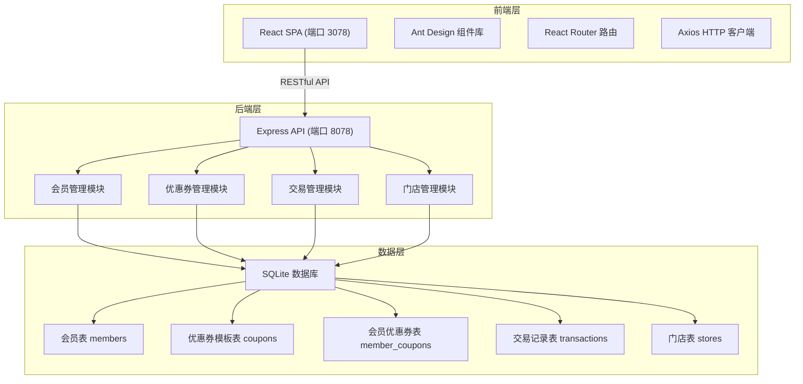
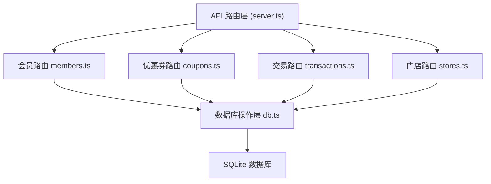
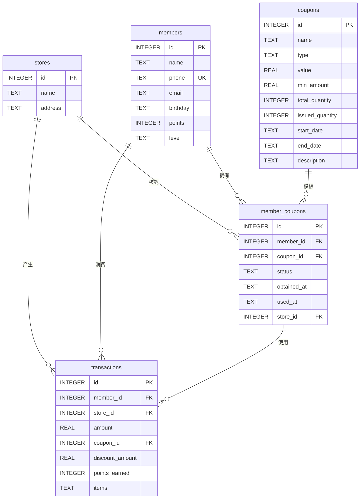

# 药店会员管理系统 技术架构文档

## 1. 架构设计



## 2. 技术描述
- 前端：React@18 + TypeScript + Vite + Ant Design@5 + React Router@6 + Axios
- 初始化工具：Vite 官方脚手架
- 后端：Express@4 + TypeScript + better-sqlite3
- 数据库：SQLite（内嵌，无需额外安装）
- 端口配置：前端 3078，后端 8078

## 3. 路由定义
| 路由 | 角色 | 页面用途 |
|-------|------|----------|
| /login | 全部 | 登录页面，选择角色登录 |
| /hq/dashboard | 总部 | 总部数据概览 |
| /hq/members | 总部 | 会员档案管理列表 |
| /hq/members/:id | 总部 | 会员详情页 |
| /hq/coupons | 总部 | 优惠券模板管理 |
| /hq/coupons/:id/issue | 总部 | 优惠券发放页面 |
| /store/search | 门店 | 会员搜索页面 |
| /store/members/:id | 门店 | 会员详情（门店视图） |
| /store/transactions | 门店 | 消费记录查询 |
| /store/order | 门店 | 创建订单/核销优惠券 |

## 4. API 定义

### 4.1 类型定义
```typescript
interface Member {
  id: number;
  name: string;
  phone: string;
  email?: string;
  birthday?: string;
  points: number;
  level: string;
  created_at: string;
}

interface CouponTemplate {
  id: number;
  name: string;
  type: '满减' | '折扣' | '立减';
  value: number;
  min_amount: number;
  total_quantity: number;
  issued_quantity: number;
  start_date: string;
  end_date: string;
  description?: string;
}

interface MemberCoupon {
  id: number;
  member_id: number;
  coupon_id: number;
  status: '未使用' | '已使用' | '已过期';
  obtained_at: string;
  used_at?: string;
  store_id?: number;
  name: string;
  type: string;
  value: number;
  min_amount: number;
}

interface Transaction {
  id: number;
  member_id: number;
  store_id: number;
  amount: number;
  coupon_id?: number;
  discount_amount: number;
  points_earned: number;
  items?: string;
  created_at: string;
  member_name: string;
  store_name: string;
  coupon_name?: string;
}

interface Store {
  id: number;
  name: string;
  address?: string;
}

interface ApiResponse<T> {
  code: number;
  message?: string;
  data?: T;
}
```

### 4.2 接口列表
| 方法 | 路径 | 说明 |
|------|------|------|
| GET | /api/health | 健康检查 |
| GET | /api/members | 获取会员列表（支持分页、搜索） |
| GET | /api/members/:id | 获取会员详情 |
| POST | /api/members | 新增会员 |
| PUT | /api/members/:id | 更新会员 |
| DELETE | /api/members/:id | 删除会员 |
| GET | /api/members/:id/coupons | 获取会员优惠券 |
| GET | /api/members/:id/transactions | 获取会员消费记录 |
| GET | /api/coupons | 获取优惠券模板列表 |
| GET | /api/coupons/:id | 获取优惠券详情 |
| POST | /api/coupons | 新增优惠券模板 |
| PUT | /api/coupons/:id | 更新优惠券模板 |
| DELETE | /api/coupons/:id | 删除优惠券模板 |
| POST | /api/coupons/:id/issue | 发放优惠券给指定会员 |
| POST | /api/coupons/issue-all | 发放优惠券给所有会员 |
| POST | /api/coupons/:id/redeem | 核销优惠券 |
| GET | /api/transactions | 获取交易记录（支持筛选） |
| GET | /api/transactions/:id | 获取交易详情 |
| POST | /api/transactions | 创建交易记录（自动处理券核销） |
| GET | /api/stores | 获取门店列表 |

## 5. 服务器架构图



## 6. 数据模型

### 6.1 ER 图



### 6.2 DDL 语句
```sql
-- 门店表
CREATE TABLE stores (
  id INTEGER PRIMARY KEY AUTOINCREMENT,
  name TEXT NOT NULL,
  address TEXT,
  created_at TEXT DEFAULT CURRENT_TIMESTAMP
);

-- 会员表
CREATE TABLE members (
  id INTEGER PRIMARY KEY AUTOINCREMENT,
  name TEXT NOT NULL,
  phone TEXT UNIQUE NOT NULL,
  email TEXT,
  birthday TEXT,
  points INTEGER DEFAULT 0,
  level TEXT DEFAULT '普通会员',
  created_at TEXT DEFAULT CURRENT_TIMESTAMP
);

-- 优惠券模板表
CREATE TABLE coupons (
  id INTEGER PRIMARY KEY AUTOINCREMENT,
  name TEXT NOT NULL,
  type TEXT NOT NULL CHECK(type IN ('满减', '折扣', '立减')),
  value REAL NOT NULL,
  min_amount REAL DEFAULT 0,
  total_quantity INTEGER NOT NULL,
  issued_quantity INTEGER DEFAULT 0,
  start_date TEXT NOT NULL,
  end_date TEXT NOT NULL,
  description TEXT,
  created_at TEXT DEFAULT CURRENT_TIMESTAMP
);

-- 会员优惠券表
CREATE TABLE member_coupons (
  id INTEGER PRIMARY KEY AUTOINCREMENT,
  member_id INTEGER NOT NULL,
  coupon_id INTEGER NOT NULL,
  status TEXT DEFAULT '未使用' CHECK(status IN ('未使用', '已使用', '已过期')),
  obtained_at TEXT DEFAULT CURRENT_TIMESTAMP,
  used_at TEXT,
  store_id INTEGER,
  FOREIGN KEY (member_id) REFERENCES members(id),
  FOREIGN KEY (coupon_id) REFERENCES coupons(id),
  FOREIGN KEY (store_id) REFERENCES stores(id)
);

-- 交易记录表
CREATE TABLE transactions (
  id INTEGER PRIMARY KEY AUTOINCREMENT,
  member_id INTEGER NOT NULL,
  store_id INTEGER NOT NULL,
  amount REAL NOT NULL,
  coupon_id INTEGER,
  discount_amount REAL DEFAULT 0,
  points_earned INTEGER DEFAULT 0,
  items TEXT,
  created_at TEXT DEFAULT CURRENT_TIMESTAMP,
  FOREIGN KEY (member_id) REFERENCES members(id),
  FOREIGN KEY (store_id) REFERENCES stores(id),
  FOREIGN KEY (coupon_id) REFERENCES member_coupons(id)
);

-- 初始数据
INSERT INTO stores (name, address) VALUES 
('中心店', '北京市朝阳区中心路1号'),
('海淀分店', '北京市海淀区海淀路2号'),
('朝阳分店', '北京市朝阳区朝阳路3号');

INSERT INTO members (name, phone, email, birthday, points, level) VALUES
('张三', '13800138001', 'zhangsan@example.com', '1990-01-15', 1500, '金卡会员'),
('李四', '13800138002', 'lisi@example.com', '1992-03-20', 800, '银卡会员'),
('王五', '13800138003', 'wangwu@example.com', '1988-07-10', 200, '普通会员');

INSERT INTO coupons (name, type, value, min_amount, total_quantity, start_date, end_date, description) VALUES
('满100减20', '满减', 20, 100, 500, '2026-01-01', '2026-12-31', '全场满100元减20元'),
('8折优惠券', '折扣', 0.8, 0, 300, '2026-01-01', '2026-06-30', '全场8折'),
('新人专享10元', '立减', 10, 0, 1000, '2026-01-01', '2026-12-31', '新会员注册专享');
```
